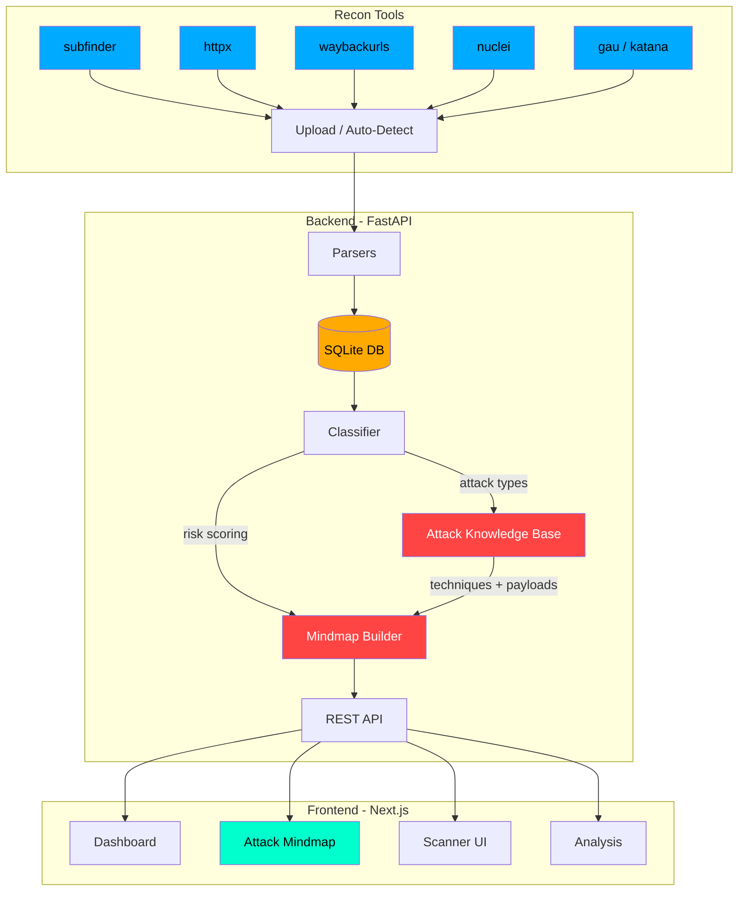
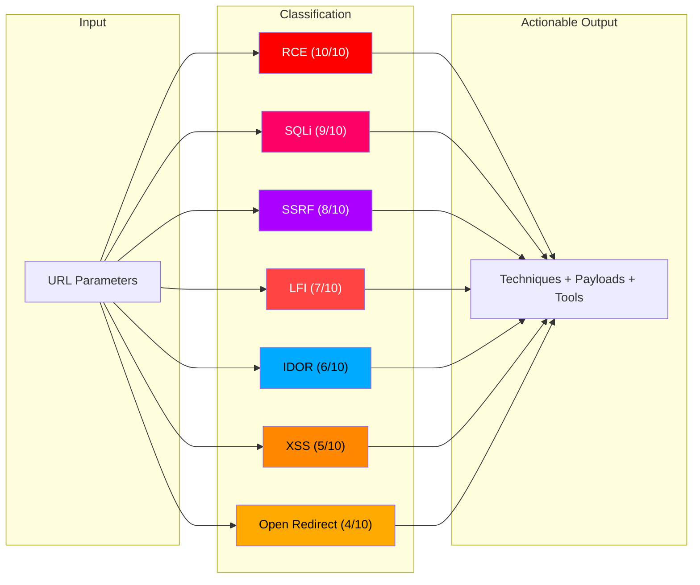
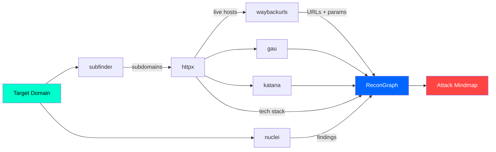
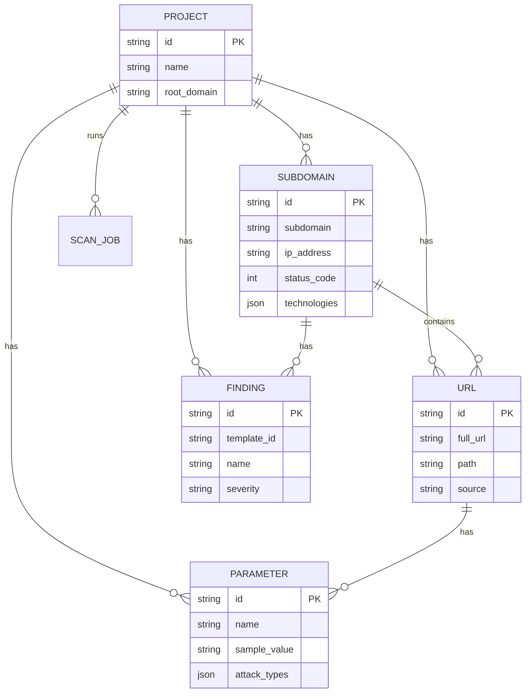

# ReconGraph

Bug bounty recon data visualizer with an interactive **Attack Mindmap**. Upload output from your recon tools, and ReconGraph classifies parameters by attack type, maps them to techniques/payloads, and gives you actionable attack guidance.

## Architecture



## Attack Mindmap Flow



## Recon Pipeline



## Data Model



## Features

- **Attack Mindmap** — Parameters grouped by attack type (RCE, SQLi, SSRF, LFI, IDOR, XSS, Open Redirect) with expandable cards showing techniques, sample payloads, and tool recommendations
- **Auto-Classification** — Parameter names are automatically classified into attack types with risk scoring (0-10)
- **Multi-Tool Parser** — Supports subfinder, httpx, waybackurls, nuclei, gau, katana output formats with auto-detection
- **Integrated Scanner** — Run recon tools directly from the UI with real-time progress streaming
- **Dashboard** — Stats overview with attack distribution pie chart, status codes, top parameters
- **Search & Filter** — Filter by attack type, search parameters, export results
- **Docker Support** — One command deployment with docker-compose

## Tech Stack

| Layer | Tech |
|-------|------|
| Backend | FastAPI, SQLAlchemy (async), aiosqlite, Pydantic v2 |
| Frontend | Next.js 14, React 18, Tailwind CSS, TypeScript |
| Database | SQLite (zero config) |

## Quick Start

### Manual Setup

```bash
# Backend
cd backend
pip install -r requirements.txt
uvicorn main:app --host 0.0.0.0 --port 8000 --reload

# Frontend (new terminal)
cd frontend
npm install
npm run dev
```

Open `http://localhost:3000`

### Docker

```bash
docker-compose up --build
```

### Load Demo Data

Upload files from `demo-data/` directory through the Upload page to test with example `target.com` data.

## Project Structure

```
recongraph/
├── backend/
│   ├── api/routes/       # FastAPI endpoints
│   ├── engine/           # Classifier, mindmap builder, attack knowledge base
│   ├── models/           # SQLAlchemy ORM models
│   ├── parsers/          # Recon tool output parsers
│   └── schemas/          # Pydantic response models
├── frontend/
│   └── src/
│       ├── app/          # Next.js pages (dashboard, scanner, attack map, upload, analysis)
│       ├── components/   # React components (mindmap, dashboard, scanner, layout)
│       └── lib/          # API client, TypeScript types
├── demo-data/            # Example recon output files (target.com)
└── docker-compose.yml
```

## Attack Types Covered

| Type | Severity | Color | Techniques |
|------|----------|-------|------------|
| RCE | 10/10 | `#ff0000` | OS Command Injection, Code Injection |
| SQLi | 9/10 | `#ff0066` | Union-Based, Blind Boolean, Time-Based |
| SSRF | 8/10 | `#aa00ff` | Internal Service Access, Cloud Metadata, Protocol Smuggling |
| LFI | 7/10 | `#ff4444` | Path Traversal, PHP Wrappers, Log Poisoning |
| IDOR | 6/10 | `#00aaff` | Horizontal Privilege Escalation, Vertical Access |
| XSS | 5/10 | `#ff8800` | Reflected, Stored, DOM-Based |
| Open Redirect | 4/10 | `#ffaa00` | URL Parameter Redirect, Login Flow Redirect |

## API Endpoints

| Method | Endpoint | Description |
|--------|----------|-------------|
| GET | `/api/projects/` | List all projects |
| POST | `/api/projects/` | Create project |
| GET | `/api/projects/{id}/mindmap` | Attack mindmap data |
| GET | `/api/projects/{id}/graph` | Force-directed graph data |
| GET | `/api/projects/{id}/stats` | Dashboard statistics |
| POST | `/api/projects/{id}/upload` | Upload recon file |
| POST | `/api/projects/{id}/upload-auto` | Auto-detect and upload |
| GET | `/api/projects/{id}/search` | Search params/URLs |
| GET | `/api/projects/{id}/params` | List parameters |
| GET | `/api/projects/{id}/attack-urls` | URLs by attack type |
| POST | `/api/scanner/start` | Start a scan |
| GET | `/api/scanner/jobs` | List scan jobs |
| GET | `/api/scanner/tools` | Check tool status |

## License

MIT

## Author

**noobie-boy**
